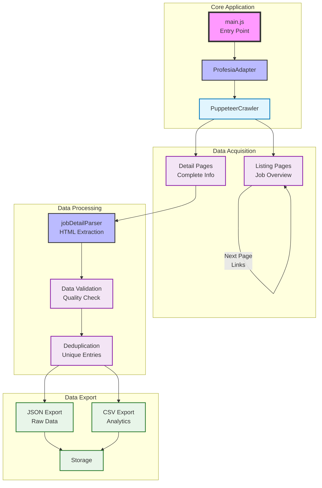
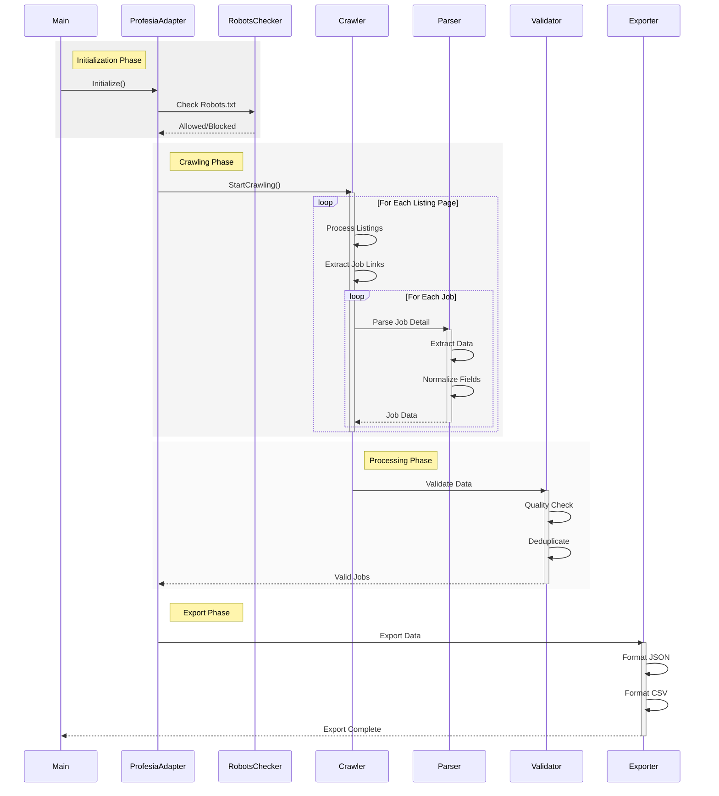
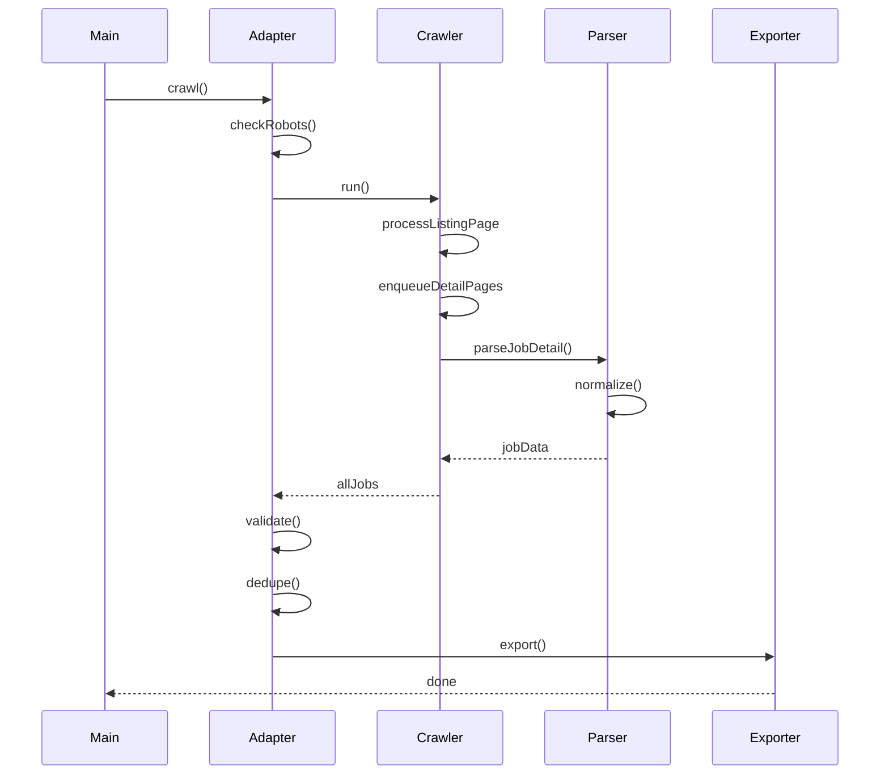

# Job Scraper (Profesia.sk) 🤖

<div align="center">
  
</div>

[](https://nodejs.org/)
[](LICENSE)
[](LICENSE.commercial)
[](https://eslint.org)

[🇸🇰 Slovenská verzia](README.sk.md)

Intelligent crawler for extracting job listings from Profesia.sk portal, built with Apify SDK and Crawlee technologies. The project implements sophisticated data acquisition with respect to ethical web scraping principles.

## 🎯 About the Project

This tool is designed as a sophisticated solution for automated job listing collection from Profesia.sk. It utilizes modern technologies and best practices for ethical web scraping:

### Key Features

- **Intelligent Crawling**: Respects robots.txt and implements advanced rate limiting
- **Robust Processing**: Reliable data extraction and normalization
- **Flexible Configuration**: Easy customization via .env file
- **Quality Output**: Structured data in JSON and CSV formats

### Technical Details

- Built with Node.js ≥ 18.0.0
- Utilizes Apify SDK and Crawlee framework
- Implements advanced retry strategies
- Ensures data validation and deduplication

## 📊 Architecture



### Sequence Diagram



### 🔄 Processing Flow

1. **Initialization** (`main.js`):
   - Loading configuration from `.env`
   - Creating `ProfesiaAdapter` instance

2. **Crawling** (`ProfesiaAdapter`):
   - Robots.txt verification
   - Rate-limiting and concurrent requests management
   - Intelligent retry/backoff strategies

3. **Parsing** (`jobDetailParser`):
   - Structured data extraction
   - Date and salary normalization
   - Completeness validation

4. **Post-processing**:
   - Deduplication by jobId
   - Data quality validation
   - Export to JSON/CSV

## 🚀 Quick Start

### Prerequisites

- Node.js ≥ 18.0.0
- npm (node package manager)

### Installation

```bash
# Clone repository
git clone <repo-url>
cd job-scraper-itssafer

# Install dependencies
npm install
```

### Configuration

Create a `.env` file in the root directory:

```env
# Base URL for crawling
START_URL=https://www.profesia.sk/praca/

# Limits and configuration
CONCURRENCY=3
MAX_PAGES=10
DELAY_MIN=1000
DELAY_MAX=1500
```

### Running

```bash
npm start
```

### Running with Podman

The project is fully containerized and can be run using Podman:

```bash
# Build the container
podman build -t job-scraper-itssafer .

# Run the container
podman run -d \
  --name job-scraper \
  -v "./output:/app/output" \
  -v "./.env:/app/.env" \
  job-scraper-itssafer

# Check container logs
podman logs -f job-scraper

# Stop the container
podman stop job-scraper
```

Benefits of using Podman:
- Rootless containers for better security
- OCI compliance
- No daemon requirement
- Native systemd integration
- Cross-platform support

## 📋 Data Model

### Output Structure

```typescript
interface Job {
    jobTitle: string;
    companyName: string;
    location: string;
    salary: {
        min: number | null;
        max: number | null;
        currency: string | null;
        period: string | null;
    };
    employmentType: string;
    seniority: string | null;
    tags: string[];
    postedAt: string; // ISO date
    jobId: string;
    jobUrl: string;
    companyUrl: string;
    description: string;
}
```

### Output Example

```json
{
    "jobTitle": "Senior Software Engineer",
    "companyName": "Example Corp",
    "location": "Bratislava",
    "salary": {
        "min": 3000,
        "max": 5000,
        "currency": "EUR",
        "period": "month"
    },
    "employmentType": "full time",
    "seniority": "senior",
    "tags": ["java", "spring", "postgresql"],
    "postedAt": "2025-10-07T00:00:00.000Z",
    "jobId": "5162007",
    "jobUrl": "https://www.profesia.sk/praca/example-corp/O5162007",
    "companyUrl": "https://firma.profesia.sk/example-corp",
    "description": "We are looking for experienced software engineer..."
}
```

## 🛠 Technical Implementation

### Components

1. **ProfesiaAdapter** (`src/adapters/ProfesiaAdapter.js`)
   - Implements crawling logic
   - Manages session and requests
   - Ensures robots.txt compliance

2. **JobDetailParser** (`src/parsers/jobDetailParser.js`)
   - Parses HTML detail pages
   - Normalizes dates and salaries
   - Extracts structured data

3. **Core Utils** (`src/utils/core.js`)
   - Validation and deduplication
   - Logging and monitoring
   - Utility functions

### Sequence Diagram



## 🧪 Testing

The project includes unit tests and integration tests:

```bash
# Run unit tests for parser
node tests/parser_unit.test.js

# Run integration test for adapter
node tests/run_adapter_check.js
```

### Test Coverage

- **Parser Tests**: Validation of salary and date processing
- **Adapter Tests**: Smoke tests for crawling logic
- **Integration**: End-to-end flow validation

## 📈 Monitoring & Reporting

The crawler generates detailed logs and statistics:

- Pages processed count
- Success/failure rate
- Timing metrics
- Memory usage

### Summary Report

After crawling completion, a report is generated with aggregated data:

- Top locations
- Salary distribution
- Most common tags/skills
- Processing statistics

## ⚖️ Ethical Scraping

The project implements best practices for ethical web scraping:

- **Robots.txt**: Automatic checking and compliance
- **Rate Limiting**: Configurable delays between requests
- **Concurrent Access**: Limited parallel requests
- **User-Agent**: Transparent identifier
- **Error Handling**: Graceful degradation on errors

## 🔍 Implementation Notes

### Rate Limiting

Crawler uses sophisticated rate limiting:

```javascript
// Example implementation in ProfesiaAdapter
function randomDelay(min, max) {
    return Math.floor(Math.random() * (max - min + 1)) + min;
}

// Usage with env configuration
await sleep(randomDelay(this.delayMin, this.delayMax));
```

### Retry Strategy

Implemented exponential backoff strategy:

```javascript
const crawler = new PuppeteerCrawler({
    maxRequestRetries: 3,
    // Crawlee handles exponential backoff internally
});
```

## 📦 Outputs

Crawler generates two types of outputs:

1. **JSON** (`./output/jobs.json`):
   - Complete data in structured format
   - Suitable for further processing

2. **CSV** (`./output/jobs.csv`):
   - Tabular format for analysis
   - Compatible with Excel/Google Sheets

## 🤝 Contributing

1. Fork the repository
2. Create a feature branch
3. Commit your changes
4. Push to the branch
5. Create a Pull Request

## 📄 Licensing

This project uses dual licensing:

### Open-Source License (AGPL-3.0)
- Free use for non-commercial purposes
- Source code must remain open
- Derivative works must also be under AGPL-3.0
- Applies to network/API usage as well

### Commercial License
For commercial use, a commercial license is required, which provides:
- Ability to use code in closed projects
- No obligation to publish source code
- Priority support
- Custom modifications without sharing

To obtain a commercial license, contact:
- Email: [itssafer@itssafer.org](mailto:itssafer@itssafer.org)
- Subject: Job Scraper - Commercial License

## 🙏 Acknowledgments

- [Apify SDK](https://sdk.apify.com/)
- [Crawlee](https://crawlee.dev/)
- [Puppeteer](https://pptr.dev/)

## 👤 Author

- **Name**: Kristián Kašník
- **Email**: [itssafer@itssafer.org](mailto:itssafer@itssafer.org)
- **GitHub**: [ITSsafer-DevOps](https://github.com/ITSsafer-DevOps)

---

Created with ❤️ for better job market analysis
