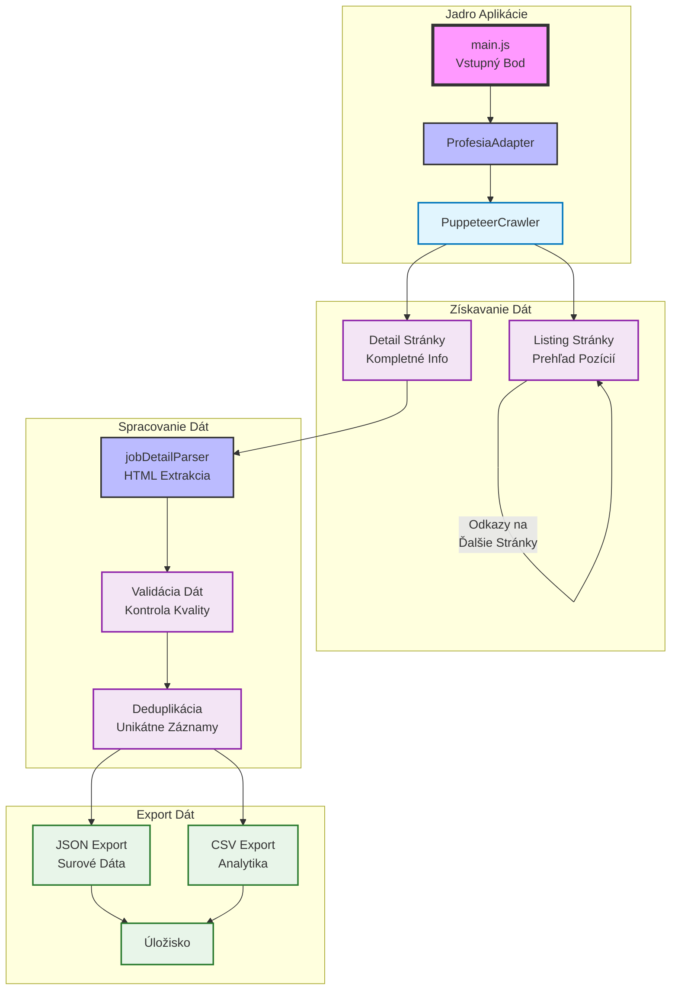
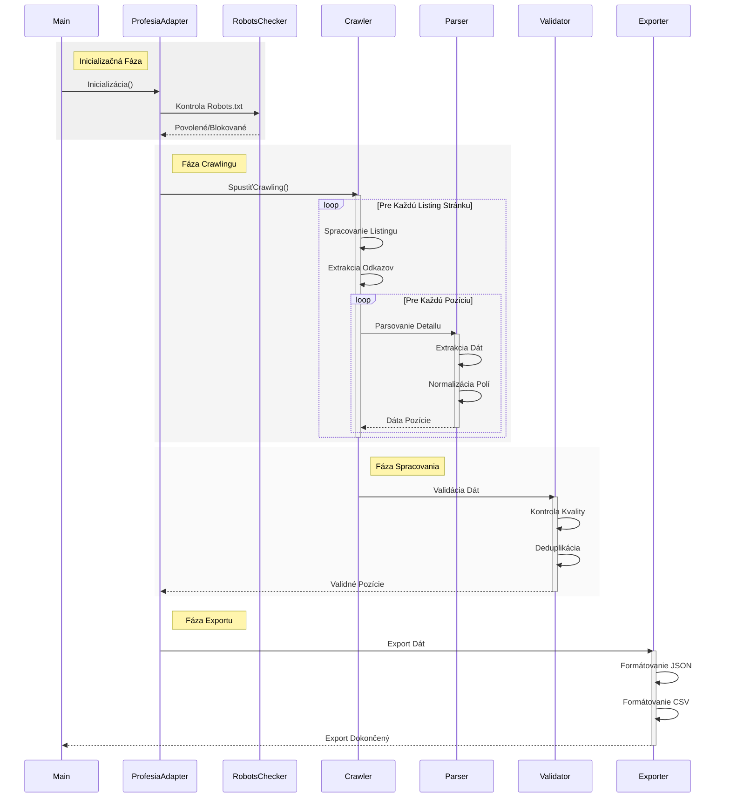
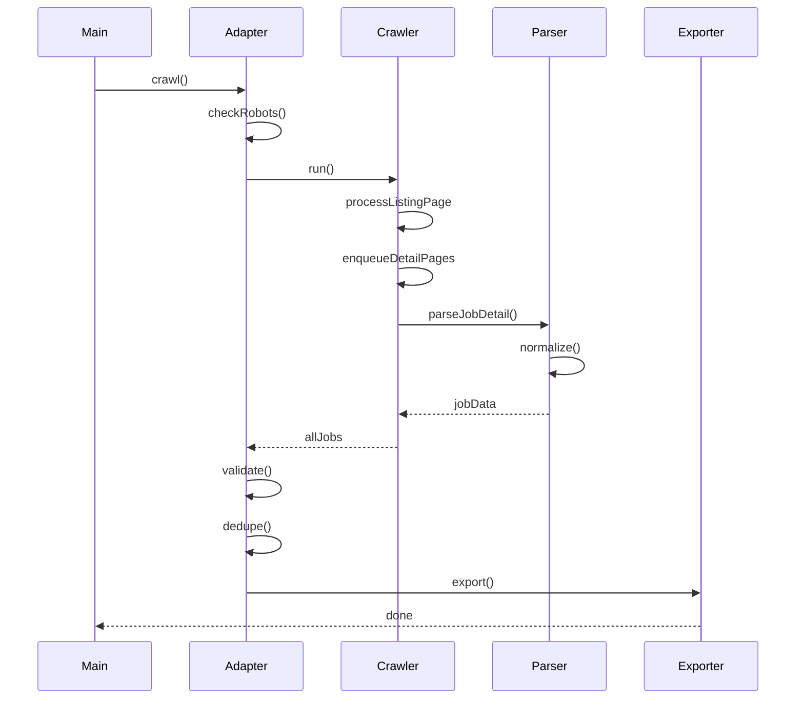

# Job Scraper (Profesia.sk) 🤖

<div align="center">
  
</div>

[](https://nodejs.org/)
[](LICENSE)
[](LICENSE.commercial)
[](https://eslint.org)


Inteligentný crawler na extrahovanie pracovných ponúk z portálu Profesia.sk, vytvorený s Apify SDK a Crawlee technológiami. Projekt implementuje sofistikované získavanie dát s rešpektovaním zásad etického web scrapingu.

## 🎯 O Projekte

Tento nástroj je navrhnutý ako sofistikované riešenie pre automatizované zbieranie pracovných ponúk z Profesia.sk. Využíva moderné technológie a osvedčené postupy pre etický web scraping:

### Kľúčové Funkcie

- **Inteligentný Crawling**: Rešpektuje robots.txt a implementuje pokročilé rate limiting
- **Robustné Spracovanie**: Spoľahlivá extrakcia a normalizácia dát
- **Flexibilná Konfigurácia**: Ľahké prispôsobenie cez .env súbor
- **Kvalitný Výstup**: Štruktúrované dáta v JSON a CSV formátoch

### Technické Detaily

- Vytvorené s Node.js ≥ 18.0.0
- Využíva Apify SDK a Crawlee framework
- Implementuje pokročilé retry stratégie
- Zabezpečuje validáciu a deduplikáciu dát

## 📊 Architektúra



### Sekvenčný Diagram



### 🔄 Proces Spracovania

1. **Inicializácia** (`main.js`):
   - Načítanie konfigurácie z `.env`
   - Vytvorenie inštancie `ProfesiaAdapter`

2. **Crawling** (`ProfesiaAdapter`):
   - Overenie robots.txt
   - Riadenie rate-limiting a súbežných requestov
   - Inteligentné retry/backoff stratégie

3. **Parsovanie** (`jobDetailParser`):
   - Extrakcia štruktúrovaných dát
   - Normalizácia dátumov a platov
   - Validácia úplnosti

4. **Post-processing**:
   - Deduplikácia podľa jobId
   - Validácia kvality dát
   - Export do JSON/CSV

## 🚀 Rýchly Štart

### Požiadavky

- Node.js ≥ 18.0.0
- npm (node package manager)

### Inštalácia

```bash
# Klonovanie repozitára
git clone <repo-url>
cd job-scraper-itssafer

# Inštalácia závislostí
npm install
```

### Konfigurácia

Vytvorte `.env` súbor v root adresári:

```env
# Base URL pre crawling
START_URL=https://www.profesia.sk/praca/

# Limity a konfigurácia
CONCURRENCY=3
MAX_PAGES=10
DELAY_MIN=1000
DELAY_MAX=1500
```

### Spustenie

```bash
npm start
```

### Spustenie s Podman

Projekt je plne kontajnerizovaný a môže byť spustený pomocou Podman:

```bash
# Zostavenie kontajnera
podman build -t job-scraper-itssafer .

# Spustenie kontajnera
podman run -d \
  --name job-scraper \
  -v "./output:/app/output" \
  -v "./.env:/app/.env" \
  job-scraper-itssafer

# Kontrola logov kontajnera
podman logs -f job-scraper

# Zastavenie kontajnera
podman stop job-scraper
```

Výhody použitia Podman:
- Rootless kontajnery pre lepšiu bezpečnosť
- OCI kompatibilita
- Nevyžaduje daemon
- Natívna systemd integrácia
- Multiplatformová podpora

## 📋 Dátový Model

### Štruktúra Výstupu

```typescript
interface Job {
    jobTitle: string;
    companyName: string;
    location: string;
    salary: {
        min: number | null;
        max: number | null;
        currency: string | null;
        period: string | null;
    };
    employmentType: string;
    seniority: string | null;
    tags: string[];
    postedAt: string; // ISO dátum
    jobId: string;
    jobUrl: string;
    companyUrl: string;
    description: string;
}
```

### Príklad Výstupu

```json
{
    "jobTitle": "Senior Software Engineer",
    "companyName": "Example Corp",
    "location": "Bratislava",
    "salary": {
        "min": 3000,
        "max": 5000,
        "currency": "EUR",
        "period": "mesiac"
    },
    "employmentType": "plný úväzok",
    "seniority": "senior",
    "tags": ["java", "spring", "postgresql"],
    "postedAt": "2025-10-07T00:00:00.000Z",
    "jobId": "5162007",
    "jobUrl": "https://www.profesia.sk/praca/example-corp/O5162007",
    "companyUrl": "https://firma.profesia.sk/example-corp",
    "description": "Hľadáme skúseného software inžiniera..."
}
```

## 🛠 Technická Implementácia

### Komponenty

1. **ProfesiaAdapter** (`src/adapters/ProfesiaAdapter.js`)
   - Implementuje crawling logiku
   - Spravuje session a requesty
   - Zabezpečuje dodržiavanie robots.txt

2. **JobDetailParser** (`src/parsers/jobDetailParser.js`)
   - Parsuje HTML detail stránky
   - Normalizuje dátumy a platy
   - Extraktuje štruktúrované dáta

3. **Core Utils** (`src/utils/core.js`)
   - Validácia a deduplikácia
   - Logovanie a monitoring
   - Pomocné funkcie

### Sekvenčný Diagram



## 🧪 Testovanie

Projekt zahŕňa unit testy a integračné testy:

```bash
# Spustenie unit testov pre parser
node tests/parser_unit.test.js

# Spustenie integračného testu adaptéra
node tests/run_adapter_check.js
```

### Pokrytie Testov

- **Parser Testy**: Validácia spracovania platov a dátumov
- **Adapter Testy**: Smoke testy pre crawling logiku
- **Integrácia**: End-to-end validácia procesu

## 📈 Monitoring & Reportovanie

Crawler generuje detailné logy a štatistiky:

- Počet spracovaných stránok
- Úspešnosť/neúspešnosť
- Časové metriky
- Využitie pamäte

### Súhrnný Report

Po ukončení crawlingu sa generuje report s agregovanými dátami:

- Top lokality
- Distribúcia platov
- Najčastejšie tagy/zručnosti
- Štatistiky spracovania

## ⚖️ Etický Scraping

Projekt implementuje osvedčené postupy pre etický web scraping:

- **Robots.txt**: Automatická kontrola a dodržiavanie
- **Rate Limiting**: Konfigurovateľné delays medzi requestami
- **Súbežný Prístup**: Limitované paralelné requesty
- **User-Agent**: Transparentný identifikátor
- **Error Handling**: Graceful degradation pri chybách

## 🔍 Poznámky k Implementácii

### Rate Limiting

Crawler používa sofistikovaný rate limiting:

```javascript
// Príklad implementácie v ProfesiaAdapter
function randomDelay(min, max) {
    return Math.floor(Math.random() * (max - min + 1)) + min;
}

// Použitie s env konfiguráciou
await sleep(randomDelay(this.delayMin, this.delayMax));
```

### Retry Stratégia

Implementovaná exponenciálna backoff stratégia:

```javascript
const crawler = new PuppeteerCrawler({
    maxRequestRetries: 3,
    // Crawlee handles exponential backoff internally
});
```

## 📦 Výstupy

Crawler generuje dva typy výstupov:

1. **JSON** (`./output/jobs.json`):
   - Kompletné dáta v štruktúrovanom formáte
   - Vhodné pre ďalšie spracovanie

2. **CSV** (`./output/jobs.csv`):
   - Tabuľkový formát pre analýzu
   - Kompatibilné s Excel/Google Sheets

## 🤝 Prispievanie

1. Fork repozitára
2. Vytvorte feature branch
3. Commit zmeny
4. Push do branch
5. Vytvorte Pull Request

## 📄 Licencovanie

Tento projekt používa duálne licencovanie:

### Open-Source Licencia (AGPL-3.0)
- Voľné použitie pre nekomerčné účely
- Zdrojový kód musí zostať otvorený
- Derivátové diela musia byť tiež pod AGPL-3.0
- Vzťahuje sa aj na sieťové/API použitie

### Komerčná Licencia
Pre komerčné použitie je potrebná komerčná licencia, ktorá poskytuje:
- Možnosť použitia kódu v uzavretých projektoch
- Bez povinnosti publikovania zdrojového kódu
- Prioritnú podporu
- Vlastné úpravy bez zdieľania

Pre získanie komerčnej licencie kontaktujte:
- Email: [itssafer@itssafer.org](mailto:itssafer@itssafer.org)
- Predmet: Job Scraper - Commercial License

## 🙏 Poďakovanie

- [Apify SDK](https://sdk.apify.com/)
- [Crawlee](https://crawlee.dev/)
- [Puppeteer](https://pptr.dev/)

## 👤 Autor

- **Meno**: Kristián Kašník
- **Email**: [itssafer@itssafer.org](mailto:itssafer@itssafer.org)
- **GitHub**: [ITSsafer-DevOps](https://github.com/ITSsafer-DevOps)

---

Vytvorené s ❤️ pre lepšiu analýzu pracovného trhu
